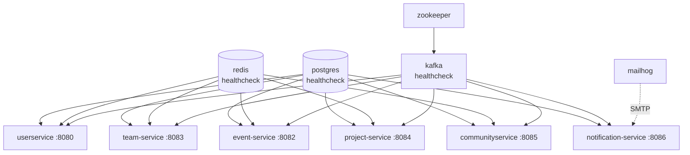
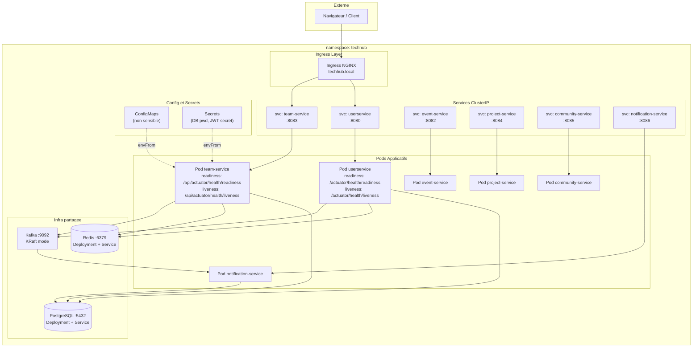

# TechHub — Partie II : DevOps

> Suite de [README_TECHHUB.md](README_TECHHUB.md) — Partie I (Développement)
> Projet ENSIAS · Encadrant : **Pr. Mahmoud El Hamlaoui**

---

# PARTIE II — DEVOPS

---

## 15. Containerisation

### Philosophie Docker de TechHub

Chaque microservice TechHub est conteneurisé via un **Dockerfile multi-stage** respectant trois principes fondamentaux :

1. **Séparation des couches de cache** — `pom.xml` copié en premier pour maximiser le cache Docker entre les builds.
2. **Image de production minimale** — base Alpine JRE uniquement, sans Maven, sans JDK complet.
3. **Sécurité par défaut** — exécution en utilisateur non-root (`techhub` group) dès la phase de build.


**Dépendances entre services (Docker Compose) :**




---

## 16. Orchestration Kubernetes

### Namespace et Organisation

Tous les composants TechHub sont déployés dans le namespace `techhub`, isolé du reste du cluster.


### Architecture K8s Complète



---

## 17. CI/CD

### Vue Globale du Pipeline

TechHub possède **un workflow GitHub Actions par service**, déclenché uniquement si des fichiers du service concerné ont été modifiés. Cela évite de rebuilder tous les services à chaque commit.


### Pipelines Community and User Services — Flux GitOps Intégré

Les pipelines Community Service et Userservice integrent Argocd : après le push de l'image Docker Hub, il **met à jour automatiquement le manifeste K8s** dans le dépôt, déclenchant la synchronisation ArgoCD :


### Sécurité des Secrets CI

| Secret GitHub | Utilisation | Service |
|---------------|-------------|---------|
| `GITHUB_TOKEN` | Authentification GHCR, push images | Team Service (auto-fourni par GitHub) |
| `DOCKERHUB_USERNAME` | Login Docker Hub | Community Service |
| `DOCKERHUB_TOKEN` | Token Docker Hub (pas de mot de passe) | Community Service |

---

## 18. GitOps avec ArgoCD

### Principe GitOps

GitOps est un modèle opérationnel où **le dépôt Git est la seule source de vérité** pour l'état désiré de l'infrastructure. ArgoCD surveille le dépôt et réconcilie en continu l'état du cluster avec les manifestes déclarés.


### Flux GitOps TechHub

```mermaid
graph LR
    subgraph "Source de Verite Git"
        GIT["GitHub Repository\ntechhub/**\nmanifests K8s"]
    end

    subgraph "CI Pipeline"
        CI["GitHub Actions\n(build, test, push image)"]
        UPDATE["Commit auto\ndeployment.yaml\n[skip ci]"]
    end

    subgraph "Continuous Delivery"
        ARGO["ArgoCD\n(polling toutes les 30s)"]
        DIFF["Diff Detection\ngit state vs cluster state"]
        SYNC["Auto-Sync\nkubectl apply"]
    end

    subgraph "Cluster Kubernetes"
        NS["namespace: techhub"]
        PODS["Pods en cours d execution"]
        HEALTH["Health Status\nHealthy / Degraded / Progressing"]
    end

    GIT --> ARGO
    CI --> UPDATE
    UPDATE --> GIT
    ARGO --> DIFF
    DIFF -->|"Out of Sync"| SYNC
    SYNC --> NS
    NS --> PODS
    PODS --> HEALTH
    HEALTH --> ARGO
```




---

## 21. Guide de Déploiement

### Prérequis

| Outil | Version minimale | Vérification |
|-------|-----------------|-------------|
| Docker Desktop | 24.x | `docker --version` |
| Docker Compose | 2.x | `docker compose version` |
| Java (Temurin) | 21 LTS | `java --version` |
| Maven | 3.9.x | `mvn --version` |
| kubectl | 1.28+ | `kubectl version --client` |
| Minikube | 1.32+ | `minikube version` |
| ArgoCD CLI | 2.x | `argocd version` |

---

### Option A — Exécution Locale avec Docker Compose


**Démarrage complet (infrastructure + services) :**

```bash
# 1. Cloner le dépôt
git clone https://github.com/ENSIAS-MEH/development-platform-geeks_team.git
cd development-platform-geeks_team/techhub

# 2. Démarrer toute l'infrastructure + services
docker compose up -d

```


---

### Option B — Déploiement Kubernetes (Minikube)


```bash
# 1. Démarrer Minikube avec suffisamment de ressources
minikube start --cpus=4 --memory=8192 --driver=docker

# 2. Activer l'addon Ingress NGINX
minikube addons enable ingress

# 3. Créer le namespace
kubectl apply -f techhub/infra/k8s/namespace.yaml

# 4. Déployer l'infrastructure partagée (PostgreSQL, Redis, Kafka)
kubectl apply -f techhub/infra/k8s/shared-infra.yaml

# 5. Vérifier que l'infra est prête
kubectl get pods -n techhub

# 6. Construire et charger les images dans Minikube (sans registry)
eval $(minikube docker-env)
docker build -t techhub/team-service:latest techhub/team-service/
docker build -t techhub/notification-service:latest techhub/notification-service/

# 7. Déployer le team-service
kubectl apply -f techhub/team-service/k8s/configmap.yaml
kubectl apply -f techhub/team-service/k8s/secret.yaml
kubectl apply -f techhub/team-service/k8s/deployment.yaml
kubectl apply -f techhub/team-service/k8s/service.yaml

# 8. Déployer tous les services (order recommandé)
for svc in userservice event-service team-service project-service communityservice notification-service; do
  kubectl apply -f techhub/$svc/k8s/
done

# 9. Appliquer l'Ingress
kubectl apply -f techhub/userservice/k8s/ingress.yaml

# 10. Ajouter techhub.local à /etc/hosts
echo "$(minikube ip) techhub.local" | sudo tee -a /etc/hosts

# 11. Vérifier l'état de tous les pods
kubectl get pods -n techhub -w

```

---
**Remarque :** Lors de la phase de déploiement sur le cluster Kubernetes local (Minikube), nous avons été confrontés à un problème de saturation mémoire. Chaque microservice étant accompagné de ses propres instances Redis, PostgreSQL et Kafka, la consommation RAM globale du cluster s'est révélée très élevée. Or, Minikube impose une allocation RAM fixe définie au moment de sa configuration — et pour tester l'ensemble de la solution, il aurait fallu augmenter cette allocation. Le problème est que la mémoire de la machine hôte était elle-même occupée à plus de 80%, rendant toute augmentation impossible : ni la RAM allouée au cluster n'était suffisante pour faire tourner tous les pods, ni la machine hôte ne disposait de la marge nécessaire pour en allouer davantage.

### Option C — Déploiement GitOps avec ArgoCD

```bash
# 1. Installer ArgoCD dans le cluster
kubectl create namespace argocd
kubectl apply -n argocd \
  -f https://raw.githubusercontent.com/argoproj/argo-cd/stable/manifests/install.yaml

# 2. Attendre que ArgoCD soit prêt
kubectl wait --for=condition=ready pod -l app.kubernetes.io/name=argocd-server \
  -n argocd --timeout=120s

# 3. Accéder à l'interface ArgoCD
kubectl port-forward svc/argocd-server -n argocd 8090:443

# 4. Récupérer le mot de passe admin initial
kubectl -n argocd get secret argocd-initial-admin-secret \
  -o jsonpath="{.data.password}" | base64 -d

# 5. Se connecter via CLI
argocd login localhost:8090 --username admin --password <mot-de-passe>

# 6. Créer l'application ArgoCD pour TechHub
argocd app create techhub \
  --repo https://github.com/ENSIAS-MEH/development-platform-geeks_team.git \
  --path techhub/team-service/k8s \
  --dest-server https://kubernetes.default.svc \
  --dest-namespace techhub \
  --sync-policy automated \
  --auto-prune \
  --self-heal

# 7. Vérifier la synchronisation
argocd app get techhub
argocd app sync techhub   # Sync manuel si nécessaire

# 8. Surveiller le statut en temps réel
argocd app list
```

**États ArgoCD :**

| État Sync | État Health | Signification |
|-----------|-------------|---------------|
| `Synced` | `Healthy` | Cluster = état Git, pods opérationnels |
| `OutOfSync` | `Progressing` | Nouveau commit détecté, déploiement en cours |
| `Synced` | `Degraded` | Déploiement terminé mais pods en échec |
| `OutOfSync` | `Healthy` | Divergence manuelle (quelqu'un a modifié le cluster directement) |


---

> **Navigation :** [Partie I — Développement](README_TECHHUB.md) | Partie II — DevOps (ce fichier)
>
> *Kawtar LAMEGHAIZI · Alae LABHAL · Hafsa ABBAR · Halima ANEJARI*
> *ENSIAS — 2025/2026 · Encadrant : Pr. Mahmoud El Hamlaoui*
