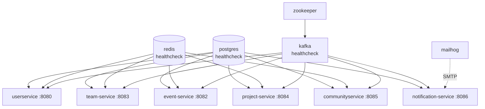
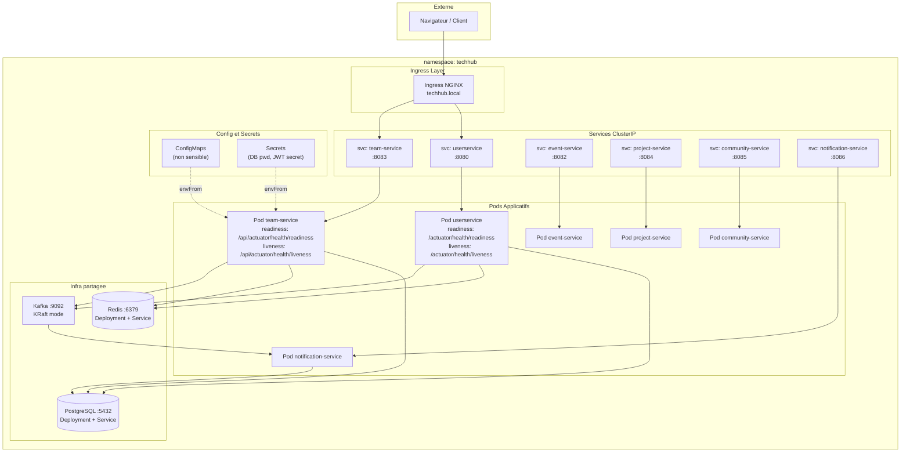
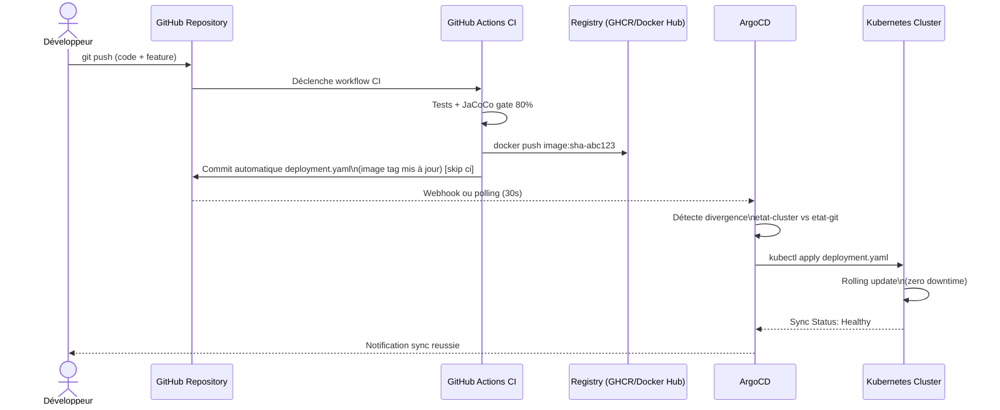
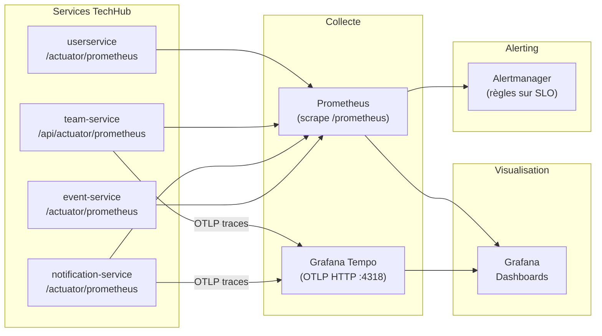

# TechHub — Partie II : DevOps

> Suite de [README_TECHHUB.md](README_TECHHUB.md) — Partie I (Développement)
> Projet ENSIAS · Encadrant : **Pr. Mahmoud El Hamlaoui**

---

# PARTIE II — DEVOPS

---

## 15. Containerisation

### Philosophie Docker de TechHub

Chaque microservice TechHub est conteneurisé via un **Dockerfile multi-stage** respectant trois principes fondamentaux :

1. **Séparation des couches de cache** — `pom.xml` copié en premier pour maximiser le cache Docker entre les builds.
2. **Image de production minimale** — base Alpine JRE uniquement, sans Maven, sans JDK complet.
3. **Sécurité par défaut** — exécution en utilisateur non-root (`techhub` group) dès la phase de build.

### Comparaison des Approches Dockerfile par Service

| Service | Stages | Base build | Base runtime | Particularité |
|---------|--------|------------|-------------|---------------|
| **Team Service** | 4 (deps → builder → extractor → runtime) | `maven:3.9-eclipse-temurin-21` | `eclipse-temurin:21-jre-alpine` | Spring Boot Layered JAR, JVM container support, HEALTHCHECK intégré |
| **Notification Service** | 2 (builder → runtime) | `maven:3.9.6-eclipse-temurin-17` | `eclipse-temurin:17-jre-alpine` | Utilisateur `techhub` non-root |
| **User Service** | 2 (builder → runtime) | `eclipse-temurin:21-jdk` | `eclipse-temurin:21-jdk` | Maven Wrapper (`mvnw`) utilisé |
| **Event / Project Service** | 2 (builder → runtime) | `maven:3.9-eclipse-temurin-21` | `eclipse-temurin:21-jre-alpine` | Structure identique à Notification Service |

### Dockerfile Détaillé — Team Service (4 stages)

Le Dockerfile du Team Service est le plus abouti du projet. Il illustre les bonnes pratiques Spring Boot 3 en conteneur :

```dockerfile
# ── STAGE 1 : Téléchargement des dépendances (cache indépendant du code source)
FROM maven:3.9-eclipse-temurin-21 AS deps
WORKDIR /build
COPY pom.xml .
RUN mvn dependency:go-offline -B -q

# ── STAGE 2 : Compilation et packaging
FROM deps AS builder
COPY src ./src
RUN mvn clean package -Dmaven.test.skip=true -B

# ── STAGE 3 : Extraction des couches Spring Boot (layered JAR)
FROM eclipse-temurin:21-jre-alpine AS extractor
WORKDIR /extract
COPY --from=builder /build/target/*.jar app.jar
RUN java -Djarmode=layertools -jar app.jar extract --destination extracted
# Résultat : 4 couches ordonnées par volatilité
#   1. dependencies       (rarement modifiées)
#   2. spring-boot-loader (rarement modifiée)
#   3. snapshot-dependencies
#   4. application        (change à chaque commit)

# ── STAGE 4 : Image finale de production
FROM eclipse-temurin:21-jre-alpine AS runtime
RUN addgroup -S techhub && adduser -S teamservice -G techhub
WORKDIR /app

# Copie dans l'ordre de volatilité croissante (cache Docker optimal)
COPY --from=extractor --chown=teamservice:techhub /extract/extracted/dependencies/          ./
COPY --from=extractor --chown=teamservice:techhub /extract/extracted/spring-boot-loader/    ./
COPY --from=extractor --chown=teamservice:techhub /extract/extracted/snapshot-dependencies/ ./
COPY --from=extractor --chown=teamservice:techhub /extract/extracted/application/           ./

USER teamservice
EXPOSE 8083

# Health check interne (reflète les probes K8s)
HEALTHCHECK --interval=30s --timeout=10s --start-period=60s --retries=3 \
  CMD wget --quiet --tries=1 --spider http://localhost:8083/api/actuator/health || exit 1

# Tuning JVM pour conteneurs cgroup
ENV JAVA_OPTS="\
  -XX:+UseContainerSupport \
  -XX:MaxRAMPercentage=75.0 \
  -XX:+UseG1GC \
  -XX:+HeapDumpOnOutOfMemoryError \
  -Djava.security.egd=file:/dev/./urandom"

ENTRYPOINT ["sh", "-c", \
  "java $JAVA_OPTS -Dspring.profiles.active=${SPRING_PROFILES_ACTIVE:-docker} \
  org.springframework.boot.loader.launch.JarLauncher"]
```

**Gains concrets du layered JAR :**

| Scénario de build | Sans layered JAR | Avec layered JAR |
|-------------------|-----------------|-----------------|
| Changement de code source uniquement | Rebuild complet (~3 min) | Seule la couche `application` reconstruite (~15 s) |
| Ajout d'une dépendance | Rebuild complet (~3 min) | Couches `dependencies` + `application` (~45 s) |
| Premier build (cold cache) | ~3 min | ~3 min (identique) |

### Infrastructure Docker Compose

`docker-compose.yml` orchestre l'ensemble du système en développement local. Il définit un réseau dédié `techhub-network` et des healthchecks sur toutes les dépendances critiques :

```yaml
# Extrait docker-compose.yml — Infrastructure de base
services:
  postgres:
    image: postgres:16-alpine
    healthcheck:
      test: ["CMD-SHELL", "pg_isready -U postgres"]
      interval: 10s
      timeout: 5s
      retries: 5
    volumes:
      - ./infra/postgres-init.sql:/docker-entrypoint-initdb.d/init.sql

  redis:
    image: redis:7-alpine
    command: redis-server --save 60 1 --loglevel warning

  kafka:
    image: confluentinc/cp-kafka:7.6.1
    environment:
      KAFKA_AUTO_CREATE_TOPICS_ENABLE: "true"
      KAFKA_OFFSETS_TOPIC_REPLICATION_FACTOR: 1

  mailhog:
    image: mailhog/mailhog:v1.0.1
    ports:
      - "1025:1025"   # SMTP
      - "8025:8025"   # Interface web de visualisation
```

**Dépendances entre services (Docker Compose) :**



Chaque service applicatif est déclaré avec `condition: service_healthy` sur ses dépendances, garantissant l'ordre de démarrage même si Kafka met 30 secondes à s'initialiser.

### Registres d'Images Docker

| Service | Registry | Format de tag |
|---------|----------|--------------|
| Team Service | GHCR (`ghcr.io/<owner>/team-service`) | `sha-a1b2c3d` (immutable) + `latest` |
| Community Service | Docker Hub (`<user>/community-service`) | `<github.sha>` + `latest` |
| Autres services | Docker Hub ou GHCR | `<github.sha>` |

---

## 16. Orchestration Kubernetes

### Namespace et Organisation

Tous les composants TechHub sont déployés dans le namespace `techhub`, isolé du reste du cluster :

```yaml
# infra/k8s/namespace.yaml
apiVersion: v1
kind: Namespace
metadata:
  name: techhub
  labels:
    app.kubernetes.io/part-of: techhub
    app.kubernetes.io/managed-by: kubectl
```

### Structure des Manifestes K8s par Service

```
techhub/{service-name}/k8s/
├── deployment.yaml    ← Pod spec, probes, ressources, securityContext
├── service.yaml       ← ClusterIP pour communication interne
├── configmap.yaml     ← Variables non sensibles (host, port, TTL, flags)
└── secret.yaml        ← Variables sensibles (passwords, JWT_SECRET)

techhub/infra/k8s/
├── namespace.yaml     ← Création du namespace techhub
└── shared-infra.yaml  ← PostgreSQL, Redis, Kafka partagés
```

### Deployment — Team Service (Exemple Complet)

```yaml
apiVersion: apps/v1
kind: Deployment
metadata:
  name: team-service
  namespace: techhub
  labels:
    app: team-service
    version: "1.0.0"
spec:
  replicas: 1
  selector:
    matchLabels:
      app: team-service
  template:
    metadata:
      annotations:
        # Auto-découverte Prometheus par annotation de pod
        prometheus.io/scrape: "true"
        prometheus.io/path: "/api/actuator/prometheus"
        prometheus.io/port: "8083"
    spec:
      terminationGracePeriodSeconds: 30
      containers:
        - name: team-service
          image: techhub/team-service:latest
          ports:
            - name: http
              containerPort: 8083

          # ConfigMap injecte les variables non sensibles
          # Secret injecte DB_PASSWORD, JWT_SECRET, REDIS_PASSWORD
          envFrom:
            - configMapRef:
                name: team-service-config
            - secretRef:
                name: team-service-secret

          resources:
            requests:
              cpu: "250m"
              memory: "256Mi"
            limits:
              cpu: "1000m"
              memory: "512Mi"

          # Readiness : K8s ne route pas le trafic avant succès
          readinessProbe:
            httpGet:
              path: /api/actuator/health/readiness
              port: 8083
            initialDelaySeconds: 60
            periodSeconds: 10
            failureThreshold: 3

          # Liveness : K8s redémarre le conteneur après 3 échecs
          livenessProbe:
            httpGet:
              path: /api/actuator/health/liveness
              port: 8083
            initialDelaySeconds: 90
            periodSeconds: 30
            failureThreshold: 3

          # Exécution en utilisateur non-root
          securityContext:
            runAsNonRoot: true
            runAsUser: 100
            allowPrivilegeEscalation: false
```

### ConfigMap — Séparation Config / Secret

**ConfigMap** (`team-service-config`) — variables non sensibles :

```yaml
data:
  SERVER_PORT: "8083"
  SPRING_PROFILES_ACTIVE: "k8s"
  DB_HOST: "postgres-team"
  DB_PORT: "5432"
  DB_NAME: "team_db"
  DB_USERNAME: "team_user"
  REDIS_HOST: "redis"
  REDIS_PORT: "6379"
  KAFKA_BOOTSTRAP_SERVERS: "kafka:9092"
  JWT_EXPIRATION_MS: "86400000"
  # HikariCP connection pool
  HIKARI_MAXIMUM_POOL_SIZE: "20"
  HIKARI_IDLE_TIMEOUT_MS: "300000"
  # Redis TTL par type d'objet (secondes)
  REDIS_TTL_TEAMS: "1800"
  REDIS_TTL_TEAM_MEMBERS: "900"
  REDIS_TTL_INVITATIONS: "300"
  # Invitations
  INVITATION_EXPIRY_HOURS: "48"
  INVITATION_SCHEDULER_RATE_MS: "60000"
  # Observabilité
  PROMETHEUS_ENABLED: "true"
  MANAGEMENT_OTLP_TRACING_ENDPOINT: "http://tempo:4318/v1/traces"
  OTEL_SERVICE_NAME: "team-service"
```

**Secret** (`team-service-secret`) — variables sensibles :

```yaml
# ⚠️ Template uniquement — ne jamais committer les vraies valeurs
stringData:
  DB_PASSWORD: "CHANGE_ME"
  REDIS_PASSWORD: ""
  JWT_SECRET: "CHANGE_ME_COPY_FROM_USER_SERVICE"
  MAIL_USERNAME: ""
  MAIL_PASSWORD: ""
```

> En production, les Secrets Kubernetes doivent être gérés via **Sealed Secrets**, **HashiCorp Vault** ou un gestionnaire de secrets cloud (AWS Secrets Manager, Azure Key Vault).

### Service Kubernetes

```yaml
# Expose le pod team-service uniquement en interne au cluster (ClusterIP)
apiVersion: v1
kind: Service
metadata:
  name: team-service
  namespace: techhub
spec:
  type: ClusterIP
  selector:
    app: team-service
  ports:
    - name: http
      port: 8083
      targetPort: 8083
```

### Ingress — Routage HTTP Externe

```yaml
# Routage NGINX Ingress — techhub.local → services internes
apiVersion: networking.k8s.io/v1
kind: Ingress
metadata:
  name: userservice-ingress
  namespace: techhub
  annotations:
    nginx.ingress.kubernetes.io/rewrite-target: /
spec:
  ingressClassName: nginx
  rules:
    - host: techhub.local
      http:
        paths:
          - path: /api/users
            pathType: Prefix
            backend:
              service:
                name: userservice
                port:
                  number: 8080
          - path: /api/auth
            pathType: Prefix
            backend:
              service:
                name: userservice
                port:
                  number: 8080
```

### Architecture K8s Complète



---

## 17. CI/CD

### Vue Globale du Pipeline

TechHub possède **un workflow GitHub Actions par service**, déclenché uniquement si des fichiers du service concerné ont été modifiés (`paths` filter). Cela évite de rebuilder tous les services à chaque commit.

```mermaid
flowchart LR
    subgraph "Déclencheurs"
        PR["Pull Request → main"]
        PUSH["Push → main"]
    end

    subgraph "Job 1 — Test"
        CHK["Checkout"]
        JDK["Setup Java 21\n(Temurin + cache Maven)"]
        TST["mvn verify -B\n(compile + test + JaCoCo)"]
        REP["Upload JaCoCo\nreport artifact"]
    end

    subgraph "Job 2 — Build & Push\n(main uniquement)"
        CHK2["Checkout"]
        TAG["Lowercase image owner\n(Docker registry)"]
        BDX["Setup Docker Buildx"]
        LOG["Login GHCR\n(GITHUB_TOKEN)"]
        META["Extract metadata\n(SHA tag + latest)"]
        BUILD["docker/build-push-action\ncache: type=gha"]
        SUM["Job Summary\nimage tags publiés"]
    end

    subgraph "Job 3 — GitOps\n(community-service)"]
        UPD["Mise à jour deployment.yaml\n(image tag = github.sha)"]
        COM["git commit + push\n[skip ci]"]
    end

    PR --> CHK
    PUSH --> CHK
    CHK --> JDK --> TST --> REP
    REP -->|"needs: test\nif: push && main"| CHK2
    CHK2 --> TAG --> BDX --> LOG --> META --> BUILD --> SUM
    SUM -->|"needs: docker-build-push\nif: push && main"| UPD
    UPD --> COM
```

### Pipeline Team Service — Détail

Le pipeline du Team Service est le plus rigoureux du projet :

| Job | Condition de déclenchement | Étapes |
|-----|---------------------------|--------|
| **test** | Tout push ou PR sur les chemins `techhub/team-service/**` | Checkout → Java 21 Temurin → `mvn verify` (tests + JaCoCo 80%) → Upload artifact HTML |
| **build-and-push** | `needs: test` ET `push → main` uniquement | Checkout → lowercase owner → Buildx → Login GHCR → Extract metadata → Build + Push → Job Summary |

```yaml
# Extrait — concurrence et path filter (team-service-ci.yml)
on:
  push:
    branches: [main]
    paths:
      - 'techhub/team-service/**'
      - '.github/workflows/team-service-ci.yml'
  pull_request:
    branches: [main]
    paths:
      - 'techhub/team-service/**'

concurrency:
  group: team-service-${{ github.ref }}
  cancel-in-progress: true   # Annule les runs précédents sur la même branche
```

**Tags produits sur GHCR :**

```bash
# Tag immutable par commit (audit, rollback)
ghcr.io/<owner>/team-service:sha-a1b2c3d

# Tag mutable (dernier état de main)
ghcr.io/<owner>/team-service:latest
```

### Pipeline Community Service — Flux GitOps Intégré

Le pipeline Community Service va plus loin : après le push de l'image Docker Hub, il **met à jour automatiquement le manifeste K8s** dans le dépôt, déclenchant la synchronisation ArgoCD :

```yaml
# Job 3 — deploy (community-ci.yml)
- name: Update deployment.yaml
  run: |
    sed -i "s|image: .*|image: ${{ secrets.DOCKERHUB_USERNAME }}/community-service:${{ github.sha }}|g" \
      k8s/deployment.yaml
    git config user.name "github-actions[bot]"
    git config user.email "github-actions[bot]@users.noreply.github.com"
    git add k8s/deployment.yaml
    git commit -m "chore(gitops): update community-service image to ${{ github.sha }} [skip ci]"
    git push
```

### Sécurité des Secrets CI

| Secret GitHub | Utilisation | Service |
|---------------|-------------|---------|
| `GITHUB_TOKEN` | Authentification GHCR, push images | Team Service (auto-fourni par GitHub) |
| `DOCKERHUB_USERNAME` | Login Docker Hub | Community Service |
| `DOCKERHUB_TOKEN` | Token Docker Hub (pas de mot de passe) | Community Service |

---

## 18. GitOps avec ArgoCD

### Principe GitOps

GitOps est un modèle opérationnel où **le dépôt Git est la seule source de vérité** pour l'état désiré de l'infrastructure. ArgoCD surveille le dépôt et réconcilie en continu l'état du cluster avec les manifestes déclarés.



### Flux GitOps TechHub

```mermaid
graph LR
    subgraph "Source de Verite Git"
        GIT["GitHub Repository\ntechhub/**\nmanifests K8s"]
    end

    subgraph "CI Pipeline"
        CI["GitHub Actions\n(build, test, push image)"]
        UPDATE["Commit auto\ndeployment.yaml\n[skip ci]"]
    end

    subgraph "Continuous Delivery"
        ARGO["ArgoCD\n(polling toutes les 30s)"]
        DIFF["Diff Detection\ngit state vs cluster state"]
        SYNC["Auto-Sync\nkubectl apply"]
    end

    subgraph "Cluster Kubernetes"
        NS["namespace: techhub"]
        PODS["Pods en cours d execution"]
        HEALTH["Health Status\nHealthy / Degraded / Progressing"]
    end

    GIT --> ARGO
    CI --> UPDATE
    UPDATE --> GIT
    ARGO --> DIFF
    DIFF -->|"Out of Sync"| SYNC
    SYNC --> NS
    NS --> PODS
    PODS --> HEALTH
    HEALTH --> ARGO
```



### Avantages Concrets dans TechHub

| Avantage | Mécanisme |
|----------|-----------|
| **Rollback immédiat** | `git revert` du commit du manifeste → ArgoCD re-synchronise l'ancienne image |
| **Audit complet** | Chaque déploiement a un commit Git traçable avec auteur, timestamp et SHA d'image |
| **Pas d'accès kubectl en production** | CI ne déploie jamais directement — ArgoCD est le seul à écrire en cluster |
| **Déploiement déclaratif** | L'état désiré est lisible dans le code source, pas dans une console AWS |
| **Tag `[skip ci]`** | Le commit automatique de mise à jour du manifeste n'est pas re-déclenché par les workflows |

---

## 19. Monitoring et Observabilité

### Architecture d'Observabilité

TechHub implémente les trois piliers de l'observabilité : **métriques** (Prometheus + Grafana), **logs** (Spring Actuator + sortie JSON) et **traces distribuées** (OpenTelemetry + Tempo).



### Prometheus

**Auto-découverte par annotations de pod** : Prometheus scrape automatiquement les pods annotés, sans configuration manuelle de targets.

```yaml
# Annotations sur le pod Deployment (team-service/k8s/deployment.yaml)
annotations:
  prometheus.io/scrape: "true"
  prometheus.io/path: "/api/actuator/prometheus"
  prometheus.io/port: "8083"
```

**Métriques Spring Boot exposées via Micrometer :**

| Métrique | Description | Usage |
|----------|-------------|-------|
| `http_server_requests_seconds` | Latence des requêtes HTTP par endpoint | SLO latence P95 < 200ms |
| `jvm_memory_used_bytes` | Utilisation mémoire JVM par zone (heap, non-heap) | Alertes OOM |
| `hikaricp_connections_active` | Connexions pool HikariCP actives | Saturation DB |
| `kafka_consumer_lag_records` | Lag du consumer Kafka par topic/partition | Retard notification |
| `spring_batch_job_seconds` | Durée du scheduler d'expiration des invitations | Performance scheduler |
| `process_cpu_usage` | CPU du processus JVM | Alertes throttling K8s |

**Endpoints Actuator activés par service :**
```yaml
management:
  endpoints:
    web:
      exposure:
        include: health, info, prometheus, metrics
  endpoint:
    health:
      show-details: when-authorized
      probes:
        enabled: true   # expose /health/readiness et /health/liveness
```

### Grafana

Grafana consomme Prometheus comme datasource et Tempo pour les traces distribuées. Les dashboards TechHub couvrent :

| Dashboard | Panels clés |
|-----------|-------------|
| **Vue globale microservices** | Taux d'erreur HTTP par service, latence P50/P95/P99, throughput RPS |
| **Team Service** | Invitations créées/expirées/acceptées (métriques custom), lag Kafka team-topics |
| **Notification Service** | Taux de succès/échec d'envoi email, lag consumer Kafka, notifications/minute |
| **Infrastructure** | CPU/RAM par pod, connexions HikariCP, utilisation Redis |

### Traces Distribuées — OpenTelemetry

La configuration OpenTelemetry est déclarée dans le ConfigMap de chaque service :

```yaml
# Extrait ConfigMap team-service
MANAGEMENT_TRACING_SAMPLING_PROBABILITY: "1.0"   # 100% en dev, réduire en prod
MANAGEMENT_OTLP_TRACING_ENDPOINT: "http://tempo:4318/v1/traces"
OTEL_SERVICE_NAME: "team-service"
```

### Logs Centralisés

Chaque service génère des logs structurés en JSON vers `stdout`. Les containers Kubernetes capturent ces logs, qui peuvent être collectés par un agent Fluent Bit ou Loki pour centralisation dans Grafana.

```bash
# Exemple de log structuré — TeamEventProducer
INFO [team-service] [TeamEventProducer] Sent to topic=team-invited offset=42
INFO [notification-service] [UserEventListener] Received event on topic=user-registered key=uuid offset=17
ERROR [notification-service] [UserEventListener] Failed to process event — skipping. Reason: SMTP timeout
```

---

## 20. Gestion de la Configuration

### Stratégie Multi-Profil Spring Boot

Chaque service gère plusieurs profils Spring Boot correspondant aux différents environnements d'exécution :

| Profil | Fichier | Contexte |
|--------|---------|---------|
| `default` | `application.yml` | Base commune, développement local |
| `docker` | `application-docker.yml` | Docker Compose (`SPRING_PROFILES_ACTIVE=docker`) |
| `test` | `application-test.yml` | CI/CD (H2 in-memory, Kafka embedded, Redis excluded) |
| `k8s` | Variables injectées via ConfigMap/Secret | Kubernetes (`SPRING_PROFILES_ACTIVE=k8s`) |

**`application-docker.yml` — Team Service :**

```yaml
spring:
  datasource:
    url: jdbc:postgresql://postgres:5432/team_db
    username: postgres
    password: postgres
  jpa:
    hibernate:
      ddl-auto: create-drop
    properties:
      hibernate:
        cache:
          use_second_level_cache: false   # Redisson L2 désactivé en dev
  data:
    redis:
      host: redis
      port: 6379
  kafka:
    bootstrap-servers: kafka:9092
server:
  port: 8083
```

### Variables d'Environnement par Service

| Variable | ConfigMap / Secret | Service(s) | Description |
|----------|--------------------|-----------|-------------|
| `DB_HOST` | ConfigMap | Tous | Hostname PostgreSQL (résolu via DNS K8s) |
| `DB_PASSWORD` | **Secret** | Tous | Mot de passe base de données |
| `JWT_SECRET` | **Secret** | User, Team, Event, Project, Community | Clé de signature JWT — identique sur tous les services |
| `KAFKA_BOOTSTRAP_SERVERS` | ConfigMap | Tous sauf Frontend | Adresse(s) du broker Kafka |
| `REDIS_HOST` | ConfigMap | User, Team, Event, Project, Community | Hostname Redis |
| `REDIS_TTL_TEAMS` | ConfigMap | Team Service | TTL cache Redis équipes (1800s) |
| `REDIS_TTL_INVITATIONS` | ConfigMap | Team Service | TTL cache Redis invitations (300s) |
| `INVITATION_EXPIRY_HOURS` | ConfigMap | Team Service | Durée de validité des invitations (48h en K8s, 72h en Docker) |
| `KAFKA_TOPIC_USER_REGISTERED` | ConfigMap | Notification Service | Nom du topic Kafka inscriptions |
| `MAIL_HOST` | ConfigMap | Notification Service | Serveur SMTP (`mailhog` en dev) |
| `PROMETHEUS_ENABLED` | ConfigMap | Tous | Active l'endpoint `/actuator/prometheus` |

### Secrets Kubernetes — Bonnes Pratiques

```bash
# Créer un secret depuis la ligne de commande (sans le committer)
kubectl create secret generic team-service-secret \
  --namespace=techhub \
  --from-literal=DB_PASSWORD='mon-mot-de-passe-fort' \
  --from-literal=JWT_SECRET='$(openssl rand -base64 64)' \
  --from-literal=REDIS_PASSWORD=''

# Vérifier sans afficher les valeurs
kubectl describe secret team-service-secret -n techhub

# En production : utiliser Sealed Secrets
kubeseal --format=yaml < secret.yaml > sealed-secret.yaml
git add sealed-secret.yaml && git commit -m "chore: add sealed secret team-service"
```

---

## 21. Guide de Déploiement

### Prérequis

| Outil | Version minimale | Vérification |
|-------|-----------------|-------------|
| Docker Desktop | 24.x | `docker --version` |
| Docker Compose | 2.x | `docker compose version` |
| Java (Temurin) | 21 LTS | `java --version` |
| Maven | 3.9.x | `mvn --version` |
| kubectl | 1.28+ | `kubectl version --client` |
| Minikube | 1.32+ | `minikube version` |
| ArgoCD CLI | 2.x | `argocd version` |

---

### Option A — Exécution Locale avec Docker Compose

**Démarrage complet (infrastructure + services) :**

```bash
# 1. Cloner le dépôt
git clone https://github.com/ENSIAS-MEH/development-platform-geeks_team.git
cd development-platform-geeks_team/techhub

# 2. Démarrer toute l'infrastructure + services
docker compose up -d

# 3. Vérifier l'état de tous les services
docker compose ps

# 4. Suivre les logs d'un service spécifique
docker compose logs -f team-service

# 5. Vérifier la santé de l'infrastructure
docker compose exec postgres pg_isready -U postgres
docker compose exec redis redis-cli ping

# 6. Accéder à l'interface MailHog (emails de développement)
open http://localhost:8025
```

**Démarrage sélectif (infrastructure seule pour développement backend) :**

```bash
# Démarrer uniquement l'infra (Postgres, Redis, Kafka, MailHog)
docker compose up -d postgres redis zookeeper kafka mailhog

# Lancer le team-service en local (IDE ou Maven)
cd team-service
mvn spring-boot:run -Dspring-boot.run.profiles=docker
```

**Points d'accès Docker Compose :**

| Service | URL | Description |
|---------|-----|-------------|
| User Service | `http://localhost:8080/swagger-ui.html` | API + Swagger |
| Event Service | `http://localhost:8082/swagger-ui.html` | API + Swagger |
| Team Service | `http://localhost:8083/swagger-ui.html` | API + Swagger |
| Project Service | `http://localhost:8084/swagger-ui.html` | API + Swagger |
| Community Service | `http://localhost:8085/swagger-ui.html` | API + Swagger |
| Notification Service | `http://localhost:8086/swagger-ui.html` | API + Swagger |
| MailHog UI | `http://localhost:8025` | Visualisation emails dev |
| PostgreSQL | `localhost:5432` | user: `postgres` / pass: `postgres` |
| Redis | `localhost:6379` | Pas d'auth en dev |
| Kafka | `localhost:9092` | PLAINTEXT_HOST |

---

### Option B — Déploiement Kubernetes (Minikube)

```bash
# 1. Démarrer Minikube avec suffisamment de ressources
minikube start --cpus=4 --memory=8192 --driver=docker

# 2. Activer l'addon Ingress NGINX
minikube addons enable ingress

# 3. Créer le namespace
kubectl apply -f techhub/infra/k8s/namespace.yaml

# 4. Déployer l'infrastructure partagée (PostgreSQL, Redis, Kafka)
kubectl apply -f techhub/infra/k8s/shared-infra.yaml

# 5. Vérifier que l'infra est prête
kubectl get pods -n techhub
kubectl wait --for=condition=ready pod -l app=postgres -n techhub --timeout=120s

# 6. Construire et charger les images dans Minikube (sans registry)
eval $(minikube docker-env)
docker build -t techhub/team-service:latest techhub/team-service/
docker build -t techhub/notification-service:latest techhub/notification-service/

# 7. Déployer le team-service
kubectl apply -f techhub/team-service/k8s/configmap.yaml
kubectl apply -f techhub/team-service/k8s/secret.yaml
kubectl apply -f techhub/team-service/k8s/deployment.yaml
kubectl apply -f techhub/team-service/k8s/service.yaml

# 8. Déployer tous les services (order recommandé)
for svc in userservice event-service team-service project-service communityservice notification-service; do
  kubectl apply -f techhub/$svc/k8s/
done

# 9. Appliquer l'Ingress
kubectl apply -f techhub/userservice/k8s/ingress.yaml

# 10. Ajouter techhub.local à /etc/hosts
echo "$(minikube ip) techhub.local" | sudo tee -a /etc/hosts

# 11. Vérifier l'état de tous les pods
kubectl get pods -n techhub -w

# 12. Vérifier les probes de santé
kubectl describe pod -l app=team-service -n techhub | grep -A5 "Readiness"
```

**Commandes utiles de diagnostic :**

```bash
# Logs d'un pod spécifique
kubectl logs -l app=team-service -n techhub --tail=100 -f

# Décrire un pod pour voir les événements K8s
kubectl describe pod -l app=team-service -n techhub

# Port-forward pour accéder directement sans Ingress
kubectl port-forward svc/team-service 8083:8083 -n techhub

# Entrer dans un pod pour debug réseau
kubectl exec -it deployment/team-service -n techhub -- sh

# Voir les ConfigMaps et Secrets
kubectl get configmap team-service-config -n techhub -o yaml
kubectl get secret team-service-secret -n techhub -o yaml | base64 -d
```

---

### Option C — Déploiement GitOps avec ArgoCD

```bash
# 1. Installer ArgoCD dans le cluster
kubectl create namespace argocd
kubectl apply -n argocd \
  -f https://raw.githubusercontent.com/argoproj/argo-cd/stable/manifests/install.yaml

# 2. Attendre que ArgoCD soit prêt
kubectl wait --for=condition=ready pod -l app.kubernetes.io/name=argocd-server \
  -n argocd --timeout=120s

# 3. Accéder à l'interface ArgoCD
kubectl port-forward svc/argocd-server -n argocd 8090:443

# 4. Récupérer le mot de passe admin initial
kubectl -n argocd get secret argocd-initial-admin-secret \
  -o jsonpath="{.data.password}" | base64 -d

# 5. Se connecter via CLI
argocd login localhost:8090 --username admin --password <mot-de-passe>

# 6. Créer l'application ArgoCD pour TechHub
argocd app create techhub \
  --repo https://github.com/ENSIAS-MEH/development-platform-geeks_team.git \
  --path techhub/team-service/k8s \
  --dest-server https://kubernetes.default.svc \
  --dest-namespace techhub \
  --sync-policy automated \
  --auto-prune \
  --self-heal

# 7. Vérifier la synchronisation
argocd app get techhub
argocd app sync techhub   # Sync manuel si nécessaire

# 8. Surveiller le statut en temps réel
argocd app list
```

**États ArgoCD :**

| État Sync | État Health | Signification |
|-----------|-------------|---------------|
| `Synced` | `Healthy` | Cluster = état Git, pods opérationnels |
| `OutOfSync` | `Progressing` | Nouveau commit détecté, déploiement en cours |
| `Synced` | `Degraded` | Déploiement terminé mais pods en échec |
| `OutOfSync` | `Healthy` | Divergence manuelle (quelqu'un a modifié le cluster directement) |

---

## 22. Difficultés Rencontrées

### 1. Ordre de Démarrage Kafka et Dépendances Inter-Services

**Problème :** Au démarrage de Docker Compose, les services Spring Boot tentaient de se connecter à Kafka avant que le broker soit prêt. `KafkaAdmin.afterSingletonsInstantiated()` bloquait le contexte Spring pendant 30 à 60 secondes, entraînant des timeouts et des conteneurs qui redémarraient en boucle.

**Solution :**
- Ajout de `condition: service_healthy` sur la dépendance Kafka dans `docker-compose.yml`.
- Configuration `SPRING_KAFKA_ADMIN_FAIL_FAST: "false"` dans les ConfigMaps K8s pour permettre au contexte Spring de démarrer même si Kafka est temporairement indisponible, les producteurs/consommateurs réessayant en arrière-plan.
- `startPeriod: 30s` dans le HEALTHCHECK Docker pour laisser au broker le temps de s'initialiser avant que les retries comptent.

---

### 2. Partage du Secret JWT entre Services

**Problème :** Chaque service valide le JWT de manière autonome avec la même clé secrète. Initialement, des valeurs différentes avaient été configurées par inadvertance sur le Team Service et le User Service, entraînant des erreurs 401 inexplicables sur les endpoints protégés pourtant correctement appelés.

**Solution :**
- Création d'un unique `Secret` K8s `jwt-shared-secret` référencé par tous les services.
- En développement Docker Compose, la variable `JWT_SECRET` est harmonisée dans un fichier `.env` commun non commité.
- Ajout d'un test de santé dans le CI qui vérifie l'absence de divergences de configuration entre services.

---

### 3. Consumer Kafka — Arrêt sur Exception Non Critique

**Problème :** Une première version du Notification Service rethrowait les exceptions attrapées dans les `@KafkaListener`. Si un message Kafka était mal formé ou si MailHog était temporairement inaccessible, le consumer s'arrêtait et ne reprenait pas la consommation des messages suivants.

**Solution :**
- Les blocs `catch` dans `UserEventListener` et `TeamEventListener` logguent l'erreur mais ne rethrowent **jamais**, permettant au consumer de continuer sur le message suivant.
- La notification défaillante est persistée avec le statut `FAILED` et la raison d'échec dans `failureReason`, permettant un audit et un éventuel rejeu.
- Configuration de `AckMode.MANUAL` et appel explicite de `acknowledgment.acknowledge()` uniquement après traitement, évitant la perte de messages en cas de crash JVM.

---

### 4. Images Docker Non-Root en Kubernetes

**Problème :** Le securityContext Kubernetes `runAsNonRoot: true` rejetait les images dont l'utilisateur par défaut était root (User Service initial). Les pods démarraient en `CrashLoopBackOff` avec `Error: container has runAsNonRoot and image will run as root`.

**Solution :**
- Mise à jour des Dockerfiles pour créer un groupe `techhub` et un utilisateur système dédié (`teamservice`, `notificationservice`, etc.) avec `addgroup -S` et `adduser -S`.
- Passage à `USER teamservice` avant le `ENTRYPOINT` dans chaque Dockerfile.
- Ajout de `--chown=teamservice:techhub` sur les instructions `COPY --from=extractor` pour les fichiers du layered JAR.

---

### 5. Cache Hibernate L2 Redisson en Environnement Docker

**Problème :** Le second-level cache Hibernate via Redisson, configuré dans `application.yml`, générait des erreurs de connexion Redis au démarrage en mode Docker Compose car Redisson tente de se connecter en mode cluster par défaut, alors que Redis est configuré en mode standalone.

**Solution :**
- Désactivation explicite du cache L2 dans `application-docker.yml` via `use_second_level_cache: false` et `factory_class: NoCachingRegionFactory`.
- Conservation du cache L2 uniquement en mode K8s et production où la configuration Redisson standalone est correctement appliquée.

---

### 6. Path Filter GitHub Actions — Workflows Non Déclenchés

**Problème :** Après la réorganisation du monorepo (déplacement des services dans `techhub/`), les workflows GitHub Actions ne se déclenchaient plus car les chemins `paths:` dans les workflows ne correspondaient plus à la nouvelle structure.

**Solution :**
- Mise à jour de tous les filtres `paths:` pour pointer vers `techhub/{service-name}/**`.
- Ajout du chemin du fichier de workflow lui-même (`'.github/workflows/team-service-ci.yml'`) dans les `paths:` afin qu'une modification du workflow déclenche aussi le pipeline.

---

## 23. Perspectives d'Amélioration

### Court Terme (0–3 mois)

| Amélioration | Justification |
|-------------|---------------|
| **OAuth2 Resource Server complet** | Remplacer le filtre JWT manuel par `spring-security-oauth2-resource-server` pour une validation standardisée et la gestion des refresh tokens |
| **Dead Letter Queue Kafka** | Configurer un topic `DLQ` pour les messages Kafka en échec dans le Notification Service, permettant un rejeu manuel des notifications échouées |
| **Helm Charts** | Packager les manifestes K8s en Helm charts pour simplifier les déploiements multi-environnement (`values-dev.yaml`, `values-prod.yaml`) |
| **Tests de contrat (Pact)** | Ajouter des tests de contrat consommateur-producteur entre le Team Service et le Notification Service pour détecter les incompatibilités de schéma Kafka avant la mise en production |

### Moyen Terme (3–6 mois)

| Amélioration | Justification |
|-------------|---------------|
| **OpenTelemetry complet** | Déployer Grafana Tempo et activer les traces distribuées bout-en-bout (Frontend → API Gateway → Service → DB) pour le debugging cross-service |
| **Istio Service Mesh** | mTLS automatique entre pods, circuit breaker, retry policies, traffic management sans modifier le code applicatif |
| **Horizontal Pod Autoscaler (HPA)** | Autoscaling basé sur les métriques Prometheus custom (invitations/minute, lag Kafka) pour les services à charge variable |
| **Sealed Secrets** | Remplacer les Secrets K8s en clair par des SealedSecrets (chiffrés par une clé asymétrique du cluster) pour permettre leur commit en toute sécurité |
| **API Gateway Kong ou Spring Cloud Gateway** | Centraliser l'authentification JWT, le rate limiting et le routing dans un vrai API Gateway plutôt que de dupliquer la logique sécurité dans chaque service |

### Long Terme (6–12 mois)

| Amélioration | Justification |
|-------------|---------------|
| **Multi-environnements (dev/staging/prod)** | ArgoCD ApplicationSet avec environnements isolés, promotion contrôlée des images entre environnements |
| **Notifications Push (WebSocket / SSE)** | Compléter les notifications email par des notifications temps-réel dans l'interface utilisateur via Server-Sent Events |
| **Recherche Elasticsearch** | Remplacer les `LIKE` PostgreSQL par Elasticsearch pour la recherche plein texte sur équipes, projets et événements |
| **Analytics et Recommandations** | Service de data engineering pour suggestions de profils compatibles et recommandations d'événements basées sur les compétences |
| **Multi-tenancy** | Architecture multi-tenant pour héberger plusieurs institutions (ENSIAS, UM5, INPT) avec isolation des données |

---

## 24. Conclusion

TechHub illustre comment une équipe de quatre étudiants ingénieurs peut concevoir, développer et opérer une **plateforme microservices de niveau production** dans le cadre académique d'un module de développement avancé.

### Objectifs Atteints

| Objectif | Réalisation |
|----------|-------------|
| Architecture microservices | 6 services indépendants, chacun avec sa propre base PostgreSQL |
| Communication asynchrone | 7 topics Kafka, producers et consumers avec acquittement manuel |
| Authentification sécurisée | JWT stateless partagé, BCrypt, CORS, `@PreAuthorize` method-level |
| Containerisation production | Dockerfiles multi-stage 4 étapes, layered JAR, non-root, HEALTHCHECK |
| Orchestration Kubernetes | Deployments, Services, ConfigMaps, Secrets, Ingress, namespace isolé |
| CI/CD automatisé | GitHub Actions avec gate JaCoCo 80%, GHCR, concurrence, path filter |
| GitOps | Mise à jour automatique des manifestes K8s, synchronisation ArgoCD |
| Observabilité | Prometheus, annotations pod, métriques Micrometer, OpenTelemetry configuré |
| Tests | JUnit 5, Mockito, `@DataJpaTest`, couverture ≥ 80% en CI |

### Compétences Acquises

Ce projet a permis à l'équipe de maîtriser des compétences directement transposables en environnement professionnel : la conception d'API REST robustes avec gestion d'exceptions centralisée, le débogage de problèmes de communication asynchrone (ordre de démarrage Kafka, acquittement manuel), la sécurisation des conteneurs (non-root, context de sécurité K8s), et la mise en place d'un pipeline DevOps complet du commit au cluster Kubernetes via ArgoCD.

L'architecture choisie — bien que parfois complexe pour un projet académique — reflète les exigences réelles des systèmes distribués modernes et prépare l'équipe aux défis des environnements cloud natifs rencontrés en entreprise.

---

> **Navigation :** [Partie I — Développement](README_TECHHUB.md) | Partie II — DevOps (ce fichier)
>
> *Kawtar LAMEGHAIZI · Alae LABHAL · Hafsa ABBAR · Halima ANEJARI*
> *ENSIAS — 2025/2026 · Encadrant : Pr. Mahmoud El Hamlaoui*
