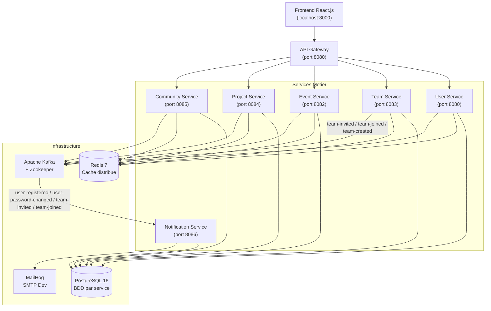
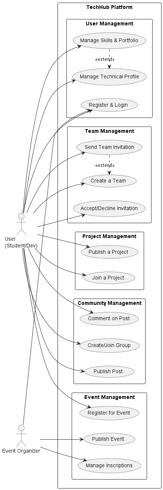
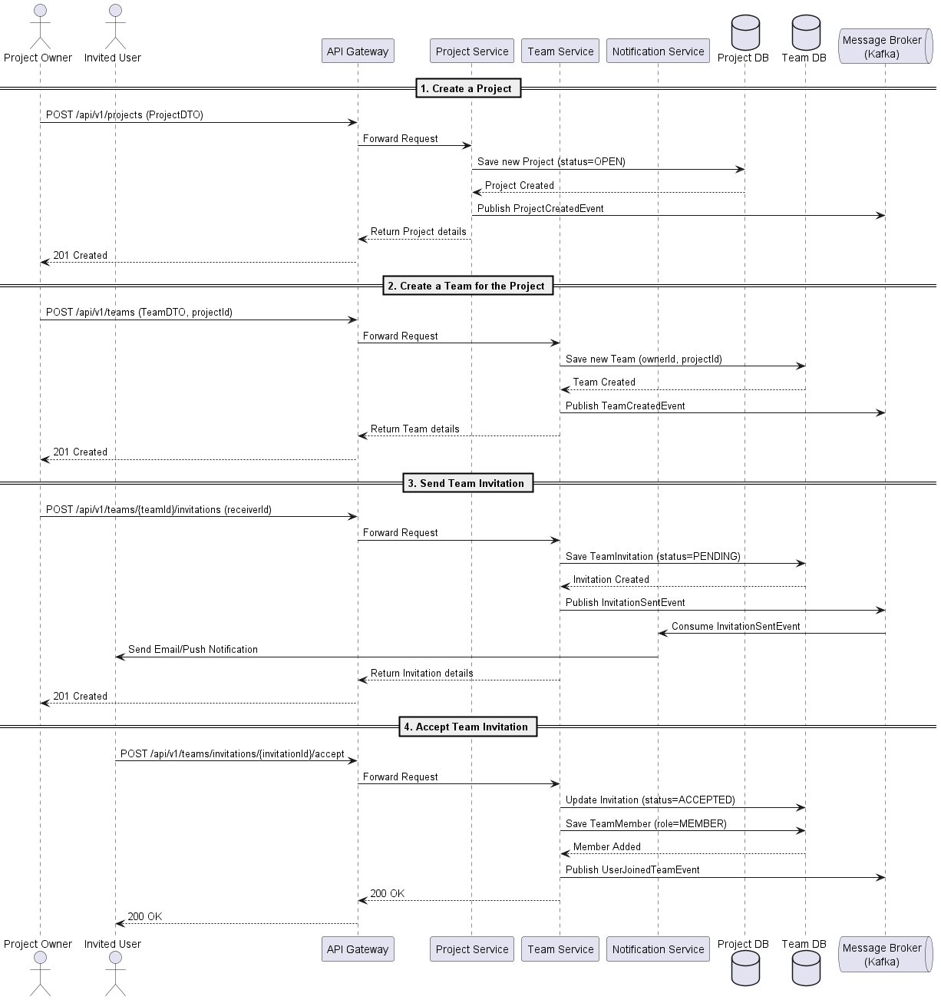
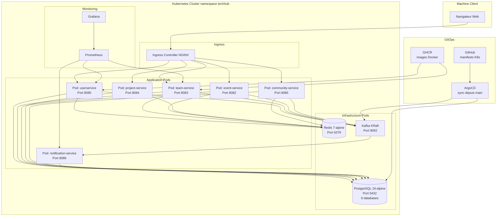

# TechHub — Plateforme Collaborative Microservices pour la Communauté Tech

> **Projet de fin de module — 2ème année Génie Logiciel**
> École Nationale Supérieure d'Informatique et d'Analyse des Systèmes (ENSIAS)
> Encadrant : **Pr. Mahmoud El Hamlaoui**

---

## 1. Présentation du Projet

### Contexte

L'écosystème technologique étudiant souffre d'une fragmentation chronique : les hackathons sont annoncés sur Devpost, les conférences sur LinkedIn ou Eventbrite, les projets sur GitHub, et les discussions communautaires sur Discord ou WhatsApp. Cette dispersion nuit à la visibilité des opportunités, à la formation d'équipes compétentes et à la pérennité des collaborations post-événement.

TechHub est une **plateforme communautaire centralisée**, développée dans le cadre du module Développement Logiciel Avancé à l'ENSIAS. Elle cible les étudiants ingénieurs, les jeunes développeurs et les organisateurs d'événements tech qui cherchent un espace unique pour découvrir des opportunités, collaborer sur des projets et s'organiser en équipes.

### Problématique

> Comment concevoir une plateforme scalable, résiliente et maintenable permettant de centraliser les événements tech, les projets collaboratifs et la gestion d'équipes, tout en garantissant une communication en temps réel entre des services indépendants et un déploiement continu en production ?

### Objectifs du Projet

- Concevoir une architecture microservices robuste avec Spring Boot 3 et Java 21.
- Implémenter une authentification stateless par JWT, partagée entre tous les services ainsi que OAuth2 (github et google).
- Assurer la communication asynchrone inter-services via Apache Kafka.
- Optimiser les lectures fréquentes avec un cache distribué Redis.
- Conteneuriser chaque service avec Docker en suivant les bonnes pratiques de multi-stage build.
- Orchestrer les déploiements avec Kubernetes dans un namespace dédié `techhub`.
- Automatiser le pipeline CI/CD via GitHub Actions avec gate de couverture JaCoCo à 80 %.
- Appliquer le paradigme GitOps avec ArgoCD pour la synchronisation continue.

### Valeur Ajoutée de la Solution

| Dimension | Apport TechHub |
|-----------|----------------|
| **Centralisation** | Un seul point d'entrée pour événements, projets, équipes et communauté |
| **Temps réel** | Notifications asynchrones par Kafka dès qu'un événement métier survient |
| **Scalabilité** | Architecture microservices — chaque service se déploie et monte en charge indépendamment |
| **Résilience** | Chaque service possède sa propre base de données, aucun single point of failure applicatif |
| **DevOps Mature** | Pipeline CI/CD complet + GitOps ArgoCD 
| **Sécurité** | JWT stateless, BCrypt, CORS configuré, method-level `@PreAuthorize` |

---

## 2. Équipe Projet

| Membre | GitHub | Rôle | Responsabilités principales |
|--------|--------|------|-----------------------------|
| **Alae LABHAL** | [@Alae-eng](https://github.com/Alae-eng) | Backend — User Service | Authentification JWT, gestion des profils, OAuth2 GitHub/Google, intégration Redis |
| **Hafsa ABBAR** | [@Hafsaabbar](https://github.com/Hafsaabbar) | Backend — Community Service | Groupes thématiques, interactions communautaires, API REST, cache Redis |
| **Halima ANEJARI** | [@Hali24-tech](https://github.com/Hali24-tech) | Backend — Event & Project Service | Gestion des événements, des projets collaboratifs, pipeline CI/CD event-service |
| **Kawtar LAMEGHAIZI** | [@KLdevs007](https://github.com/KLdevs007) | Backend — Team & Notification Service | Équipes, invitations, expiration scheduler, Kafka producer/consumer, emails MailHog |
| **Pr. Mahmoud El Hamlaoui** | — | Encadrant | Supervision académique, validation architecturale, évaluation |

---

## 3. Table des Matières

Développer la table des matières complète

### PARTIE I — DÉVELOPPEMENT
- [4. Analyse des Besoins](#4-analyse-des-besoins)
- [5. User Stories](#5-user-stories)
- [6. Architecture Fonctionnelle](#6-architecture-fonctionnelle)
- [7. Conception UML](#7-conception-uml)
  - [7.1 Diagramme de Cas d'Utilisation](#71-diagramme-de-cas-dutilisation)
  - [7.2 Diagramme de Classes](#72-diagramme-de-classes)
  - [7.3 Diagrammes de Séquence](#73-diagrammes-de-séquence)
  - [7.4 Diagramme de Déploiement](#74-diagramme-de-déploiement)
- [8. Architecture Logicielle](#8-architecture-logicielle)
- [9. Choix Technologiques](#9-choix-technologiques)
- [10. Implémentation Backend](#10-implémentation-backend)
- [11. Base de Données](#11-base-de-données)
- [12. Sécurité](#12-sécurité)
- [13. Documentation API](#13-documentation-api)
- [14. Tests](#14-tests)

### PARTIE II — DEVOPS
- [15. Containerisation](#15-containerisation)
- [16. Orchestration Kubernetes](#16-orchestration-kubernetes)
- [17. CI/CD](#17-cicd)
- [18. GitOps avec ArgoCD](#18-gitops-avec-argocd)
- [19. Monitoring et Observabilité](#19-monitoring-et-observabilité)
- [20. Gestion de la Configuration](#20-gestion-de-la-configuration)
- [21. Guide de Déploiement](#21-guide-de-déploiement)
- [22. Difficultés Rencontrées](#22-difficultés-rencontrées)
- [23. Perspectives d'Amélioration](#23-perspectives-damélioration)
- [24. Conclusion](#24-conclusion)

---

# PARTIE I — DÉVELOPPEMENT

---

## 4. Analyse des Besoins

### Besoins Fonctionnels

**Module Utilisateur**
- Inscription et connexion via email/mot de passe avec hachage BCrypt.
- Authentification OAuth2 sociale via GitHub et Google.
- Gestion du profil technique : compétences, biographie, portfolio, liens GitHub/LinkedIn.
- Accès sécurisé par token JWT avec durée de vie configurable.
- Changement de mot de passe avec notification automatique par email.
- Trouver des collaborateurs.

**Module Équipe**
- Création d'une équipe avec nom, description, capacité maximale et statut (`OPEN` / `FULL`).
- Invitation de membres par UUID d'utilisateur avec une durée de validité paramétrable (défaut : 72 h).
- Acceptation ou refus d'une invitation depuis le tableau de bord.
- Expiration automatique des invitations non traitées via un scheduler Spring (`@Scheduled`).
- Départ volontaire ou exclusion d'un membre par le propriétaire de l'équipe.
- Recherche paginée d'équipes publiques par mots-clés.

**Module Notification**
- Envoi d'email transactionnel à chaque événement métier critique (inscription, changement de mot de passe, invitation, intégration à une équipe).
- Persistance des notifications dans PostgreSQL avec statut (`SENT` / `FAILED`) et horodatage.
- Lecture des événements Kafka de manière asynchrone avec acquittement manuel.
- Exposition d'une API REST pour la consultation et le marquage "lu" des notifications.

**Module Événement**
- Publication d'événements (hackathon, conférence, workshop, meetup) avec dates, lieu et capacité.
- Inscription et désinscription des participants.
- Statistiques d'audience et suivi de remplissage.

**Module Projet**
- Soumission d'idées et de projets collaboratifs avec description et stack technique.
- Recherche de collaborateurs selon compétences.
- Gestion du statut des projets (idée, en cours, terminé).

**Module Communauté**
- Création et gestion de groupes thématiques.
- Publication de posts et commentaires.
- Système de membres et modération.

---

## 5. User Stories

| ID | En tant que | Je veux | Afin de | Priorité |
|----|-------------|---------|---------|----------|
| US-01 | Visiteur | M'inscrire avec mon email et un mot de passe | Créer mon compte sur TechHub | Haute |
| US-02 | Visiteur | Me connecter via GitHub OAuth2 | Éviter de gérer un nouveau mot de passe | Haute |
| US-03 | Utilisateur authentifié | Créer une équipe avec un nom et une capacité max | Trouver des coéquipiers pour mon hackathon | Haute |
| US-04 | Propriétaire d'équipe | Inviter un utilisateur dans mon équipe | Constituer mon équipe avant la deadline | Haute |
| US-05 | Utilisateur invité | Accepter ou refuser une invitation | Rejoindre l'équipe qui m'intéresse | Haute |
| US-06 | Utilisateur | Recevoir un email lors de mon inscription | Être confirmé que mon compte est actif | Haute |
| US-07 | Utilisateur | Recevoir un email quand je rejoins une équipe | Être notifié de l'événement en temps réel | Moyenne |
| US-08 | Utilisateur | Consulter la liste des équipes disponibles | Trouver une équipe qui me correspond | Moyenne |
| US-09 | Propriétaire d'équipe | Exclure un membre de mon équipe | Maintenir la qualité et la cohésion | Moyenne |
| US-10 | Utilisateur | Quitter une équipe dont je suis membre | Me désengager d'une collaboration | Moyenne |
| US-11 | Utilisateur | Consulter mes notifications passées | Retracer les actions importantes | Basse |
| US-12 | Organisateur | Publier un événement tech avec date et lieu | Annoncer mon hackathon à la communauté | Haute |
| US-13 | Participant | M'inscrire à un événement | Réserver ma place avant saturation | Haute |
| US-14 | Utilisateur | Publier un projet avec sa stack technique | Recruter des collaborateurs compétents | Moyenne |
| US-15 | Administrateur | Modérer les contenus publiés | Maintenir la qualité de la communauté | Basse |
| US-16 | Utilisateur | Changer mon mot de passe | Sécuriser mon compte | Haute |
| US-17 | Utilisateur | Rechercher des équipes par mots-clés | Trouver rapidement une équipe pertinente | Moyenne |
| US-18 | Système | Expirer automatiquement les invitations périmées | Éviter les invitations fantômes en base | Haute |

---

## 6. Architecture Fonctionnelle

TechHub est organisé autour de six domaines métier indépendants, chacun encapsulé dans un microservice autonome. Le frontend React.js communique exclusivement avec un **API Gateway** qui route les requêtes vers le service approprié. La communication entre services est **asynchrone via Kafka** pour les événements métier, et **synchrone via REST** pour les appels nécessitant une réponse immédiate.

### Vue d'Ensemble des Interactions

### Description des Flux Principaux

**Inscription utilisateur :** L'utilisateur soumet son formulaire → User Service valide, hache le mot de passe, persiste → publie `user-registered` sur Kafka → Notification Service consomme l'événement → envoie l'email de bienvenue via MailHog → persiste la notification avec statut `SENT`.

**Invitation dans une équipe :** Le propriétaire invite un utilisateur → Team Service vérifie la capacité et l'absence de doublon → crée l'invitation en base (statut `PENDING`, TTL 72h) → publie `team-invited` sur Kafka → Notification Service envoie l'email d'invitation → le scheduler `InvitationExpirationScheduler` expire les invitations à chaque minute.

**Acceptation d'invitation :** L'invité accepte → Team Service marque l'invitation `ACCEPTED` → incrémente `currentMembers` → si `isFull()` : statut équipe passe à `FULL` → publie `team-joined` → Notification Service notifie le propriétaire.

---

## 7. Conception UML

### 7.1 Diagramme de Cas d'Utilisation

#### Acteurs du Système

| Acteur | Description |
|--------|-------------|
| **Membre** | Utilisateur authentifié avec accès complet aux fonctionnalités sociales |
| **Manager / Propriétaire** | Membre pouvant créer et gérer une équipe ou un événement |

---

### 7.2 Diagramme de Classes

.png)

### 7.3 Diagrammes de Séquence

---

### 7.4 Diagramme de Déploiement

---

**Technologies clés :** Spring Kafka, Spring Mail, Spring Data JPA

### Topics Kafka du Projet

| Topic | Producteur | Consommateur | Déclencheur |
|-------|------------|--------------|-------------|
| `user-registered` | User Service | Notification Service | Nouvel utilisateur créé |
| `user-password-changed` | User Service | Notification Service | Changement de mot de passe |
| `team-created` | Team Service | — | Nouvelle équipe créée |
| `team-invited` | Team Service | Notification Service | Invitation envoyée |
| `team-joined` | Team Service | Notification Service | Invitation acceptée |
| `team-full` | Team Service | — | Équipe atteint sa capacité max |
| `team-left` | Team Service | — | Membre quitte l'équipe |

---

## 9. Choix Technologiques

| Technologie | Version | Utilisation dans TechHub | Justification |
|-------------|---------|--------------------------|---------------|
| **Java** | 21 (LTS) | Langage principal de tous les microservices | Dernière LTS avec support Temurin garanti jusqu'en 2030. Records, sealed classes, performance améliorée. |
| **Spring Boot** | 3.x | Framework applicatif de chaque microservice | Autoconfiguration, Actuator intégré, compatibilité Jakarta EE 10. Réduction drastique du boilerplate. |
| **Spring Security** | 6.x | Authentification JWT, CORS, `@PreAuthorize` | Intégration native avec Spring Boot 3, SecurityFilterChain fluent API, method security sans XML. |
| **Spring Data JPA** | 3.x | ORM et accès aux données PostgreSQL | Repositories génériques, queries JPQL, pagination intégrée. Évite le SQL manuel répétitif. |
| **PostgreSQL** | 16 | Base de données relationnelle par service | ACID complet, support UUID natif, index partiels, types JSON. 6 bases isolées via `postgres-init.sql`. |
| **Apache Kafka** | 7.6.1 (Confluent) | Bus de messages asynchrone inter-services | Rétention configurable, consumer groups, acquittement manuel. Découple totalement producteurs et consommateurs. |
| **Redis** | 7 | Cache distribué, cache Hibernate L2 | Ultra-faible latence (<1 ms), TTL natif, support Redisson pour second-level cache. |
| **Redisson** | — | Second-level cache Hibernate (Team Service) | Intégration Hibernate 6, stratégie `READ_WRITE` sur entités `Team` mise en cache dans région nommée `teams`. |
| **Docker** | — | Conteneurisation multi-stage | Image minimale Alpine JRE + non-root user + Spring Boot layered JAR = images < 200 MB. |
| **Kubernetes** | — | Orchestration en cluster | Déploiements reproductibles, probes de santé, ConfigMaps/Secrets, namespace isolé `techhub`. |
| **ArgoCD** | — | GitOps Continuous Delivery | Synchronisation automatique depuis le dépôt Git, réconciliation de l'état déclaré. |
| **GitHub Actions** | — | CI/CD automatisé | Pipeline test → build → push GHCR déclenché sur push/PR. Cache Maven GHA. Gate JaCoCo 80 %. |
| **GHCR** | — | Registry d'images Docker | Intégré à GitHub, authentification via `GITHUB_TOKEN`, tags SHA immutables (`sha-a1b2c3d`). |
| **Swagger / OpenAPI** | 3.0 | Documentation API REST | Interface interactive, génération auto depuis annotations Spring. URL : `/swagger-ui.html`. |
| **JUnit 5** | — | Tests unitaires | Annotations déclaratives, paramétrage, modèle d'extension. |
| **Mockito** | — | Mocking dans les tests unitaires | Stubbing précis, vérification des interactions entre couches. |
| **JaCoCo** | — | Couverture de code | Gate CI à 80 % sur les lignes — bloque le merge si non atteint. |
| **Lombok** | — | Réduction du boilerplate Java | `@Builder`, `@Getter`, `@RequiredArgsConstructor` — élimine ~60 % du code répétitif. |
| **MailHog** | 1.0.1 | SMTP de développement | Interface web sur `:8025`, intercepte tous les emails sans envoi réel. Remplacé par un SMTP réel en production. |
| **React.js** | — | Interface utilisateur frontend | Composants réutilisables, routing SPA, consommation des APIs REST. |
| **Tailwind CSS** | — | Styling utilitaire | Design system cohérent via classes utilitaires, compatible avec shadcn/ui. |
| **Maven** | 3.9 | Gestion de build et dépendances | Phases lifecycle (clean/verify/package), plugins Surefire/Failsafe/JaCoCo, cache GHA. |

---

